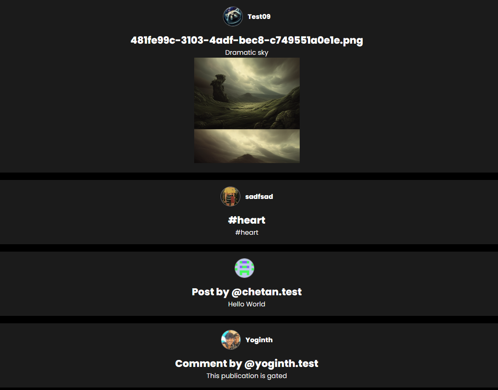
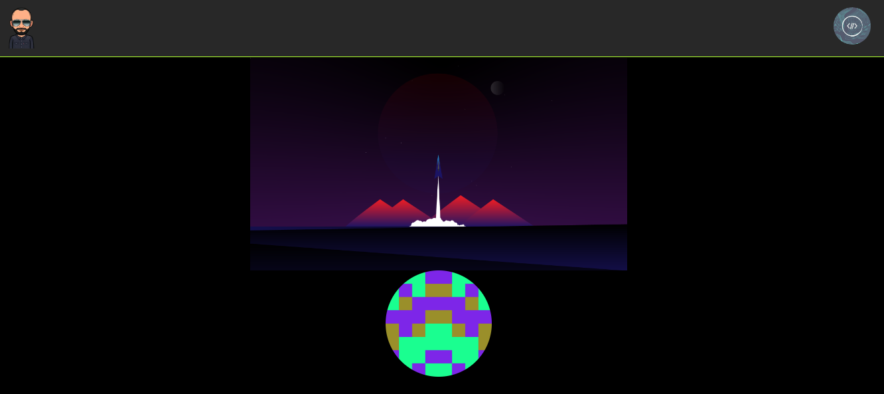
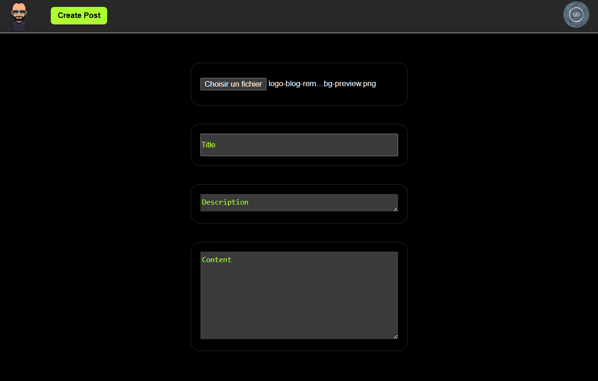

<div style="margin-bottom: 35px;"></div>

# <span style="color: greenyellow;">**Lens**</span> Bendevweb Social Media

### _This project was built with :_

<div style="margin-bottom: 15px;"></div>

 <span style="margin-left: 10px;"></span>  <span style="margin-left: 10px;"></span> 

#

### <span style="color: greenyellow; font-weight: 500; text-decoration: underline">_Important_</span>

> To be `able` to use this application and connect to your account you must have a `wallet` like :

- [Metamask](https://metamask.com) 🦊
- [Coinnbase](https://coinbase.com) 🪙

#

### <span style="color: greenyellow; font-weight: 500; text-decoration: underline">_Project Information_</span>

- Project running on the blockchain thanks to [Thirdweb](https://thirdweb.com) and the [Lens](https://docs.lens.xyz/docs) protocol. 🌿

<div style="margin-top: 15px;"></div>

[**EIP-712**](https://eips.ethereum.org/EIPS/eip-712)

- Standard for hashing and signing of typed structured data as opposed to just bytestrings.

- This EIP aims to improve the usability of message signing.

[**IPFS**](https://docs.ipfs.tech/concepts/what-is-ipfs/#decentralization)

- IPFS is a distributed system for storing and accessing files, websites, applications, and data.

[**ABI**](https://solidity-fr.readthedocs.io/fr/latest/abi-spec.html#:~:text=The%20Contract%20Application%20Binary%20Interface%20%28ABI%29%20is%20the,to%20its%20type%2C%20as%20described%20in%20this%20specification.)

- Contract Application Binary Interface (ABI) is the standard way to interact with contracts in the Ethereum ecosystem, both from outside the blockchain and for contract-to-contract interaction.

#

### <span style="color: greenyellow; font-weight: 500;">Getting Started</span>

First, run the development server:

```bash
npm run dev
# or
yarn dev
# or
pnpn run dev
```

#

### <div style="color: greenyellow; font-weight: 500; margin-bottom: 15px;">Render Dapp</div>

#### **Posts Section**

<div style="margin-bottom: 10px;"></div>



<div style="margin: 20px 0px;"></div>

#### <span style="color: greenyellow;">**Profile Section**</span>

<div style="margin-bottom: 10px;"></div>



<div style="margin-bottom: 10px;"></div>

#### <span style="color: greenyellow;">**Create Post Section**</span>

<div style="margin-bottom: 18px;"></div>



#

### <span style="color: greenyellow; font-weight: 500;">_Deployement_</span>


The easiest way to deploy your Next.js app is to use the [Vercel Platform](https://vercel.com/new?utm_medium=default-template&filter=next.js&utm_source=create-next-app&utm_campaign=create-next-app-readme) from the creators of Next.js.

Check out our [Next.js deployment documentation](https://nextjs.org/docs/deployment) for more details.
